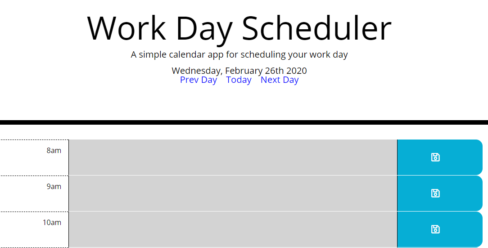

# day-planner

Test it out [here](https://guyfromhere.github.io/day-planner/).

## Description

Simple day planner app. It uses moment.js and localStorage to show the user's plans over a standard 8-5 work day.

## Installation

Download the files and open index.html in a browser.

